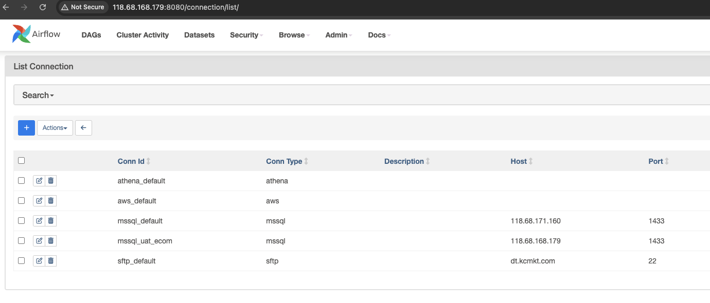

## How to update password for SFTP connection in Airflow ?

Official documentation from Airflow: [Airflow Connection](https://airflow.apache.org/docs/apache-airflow/stable/howto/connection.html)

First, open the connection section in Airflow Web UI
>> Admin >> connections

Click on the edit icon on the left of connection need to change (sftp_default):

input new password into password-field, then click save button
