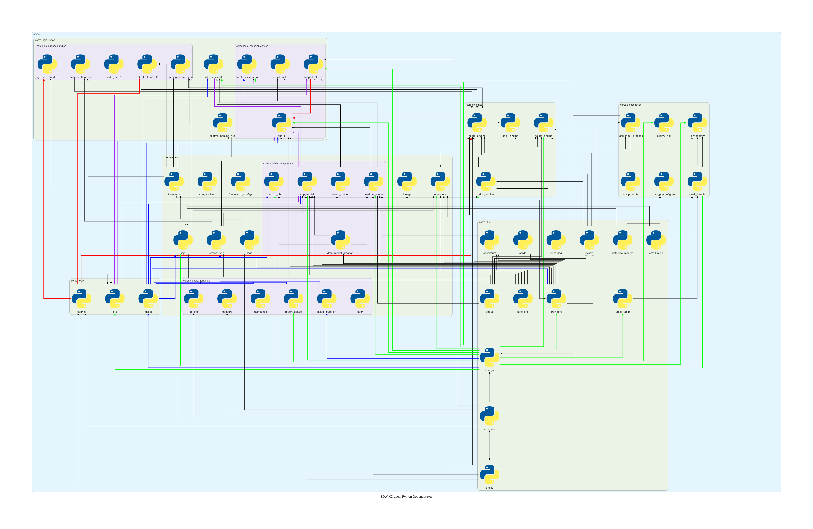

# Project Dependencies

Below is the image of project's dependencies (cores section)

This image generate manually using python, run script in path: /document/generate_diagrams.py
whenever you need to reload the dependencies of the project
